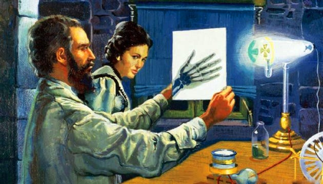

# Історія радіобіології в Україні: витоки, становлення, розвиток

Чудо-промені видатного українця. Іван Пулюй https://www.ukrinform.ua/rubric-culture/2867756-cudopromeni-vidatnogo-ukrainca-ivan-puluj.html

Ця монографія “Історія радіобіології в Україні: витоки, становлення, розвиток” написана Ігорем Миколайовичем Гудковим і присвячена історії розвитку радіобіології в Україні, починаючи з кінця 19-го століття до сьогодні. Відкривши цей труд Ви дізнаєтеся про основні напрямки досліджень, результати наукових досягнень та маловідомі події, які стали важливими етапами у становленні цієї молодої науки в Україні. Ця інформація може бути корисною та цікавою для вас.

У монографії описані такі основні етапи розвитку радіобіології в Україні:

1. **Початковий період (кінець 19-го — початок 20-го століття)**: Виникнення основ радіобіології, перші дослідження з біологічної дії іонізуючої радіації, а також формування перших наукових товариств, таких як Одеське товариство рентгенологів, засноване Яковом Мойсейовичем Розенблатом.
2. **Розвиток у 1950-х роках**: Активні дослідження в галузі радіобіології та радіоекології, зокрема в Інституті фізіології рослин АН УРСР під керівництвом Дмитра Михайловича Гродзинського, що включали вивчення природної радіоактивності рослин і ґрунтів.
3. **Сучасний етап (кінець 20-го — початок 21-го століття)**: Продовження досліджень у галузі радіобіології, зокрема в контексті радіаційної безпеки та екології, а також зростання кількості наукових публікацій і дослідників у цій сфері.

Ці етапи підкреслюють еволюцію радіобіології в Україні, її інтеграцію в міжнародну науку та її важливість для медичних і екологічних досліджень. У монографії також зазначені результати наукових досліджень у галузі радіоекології, що є важливими для розуміння впливу радіації на довкілля та здоров’я людей.

# Джерело

Гудков І.М. Історія радіобіології в Україні: витоки, становлення, розвиток: монографія. Київ: НУБіП України, 2024. 114 с. https://github.com/protw/oleghbond/blob/master/radiobiology/240818%20Radiobiology%20history%20of%20Ukraine.pdf

# Англомовна стаття

History of radiobiology in Ukraine: origins, formation, development — https://medium.com/p/7e8adac88436